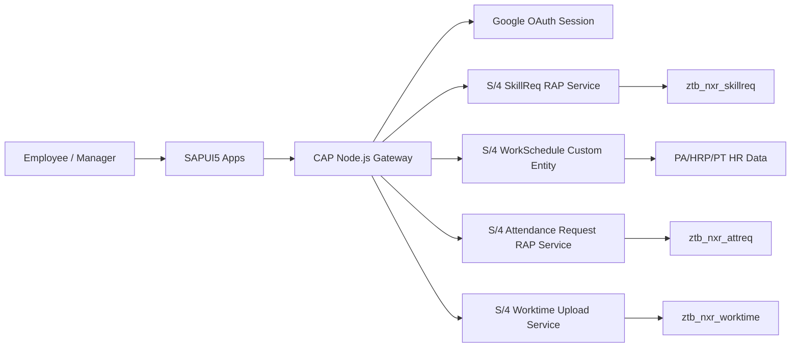

# SkillCert CAP - Technical Business and Backend Analysis

## 1. Executive Summary

This project is a SAP CAP Node.js gateway for a SAPUI5 business portal. It does not own most business data locally; instead, it authenticates users, protects UI/API routes, and proxies or orchestrates several S/4HANA OData V4/RAP services.

Main business areas:

- Skills and certifications: employee self-service submission plus manager approval.
- Employee profile and team visibility: map logged-in email/user to SAP personnel number and organizational team.
- Work schedule and attendance view: render planned shifts, actual attendance, absences, and derived status.
- Attendance requests: create day off, work from home, overtime, and edit-timesheet requests.
- HR worktime upload: parse spreadsheet records and upload worktime entries into SAP.

Backend services discovered through MCP `s40-324`:

| Area | CAP API | SAP Service / Binding | Main SAP Entity | Storage / Source |
| --- | --- | --- | --- | --- |
| Skills and certifications | `/api/v1` | `ZUI_NXR_SKILLREQ_O4` | `Request`, `UserProfile`, `TeamMembers`, `QualificationCatalog` | `ztb_nxr_skillreq`, HR master data |
| Work schedule | `/api/v2` | `ZUI_NXR_WORKSCHEDULE_O4` / `ZSD_NXR_WORKSCHEDULE` | `WorkSchedule` | HR schedule/infotype data |
| Attendance requests | `/api/v3` | `ZUI_NXR_ATTREQ_O4` / `ZSD_NXR_ATTREQ_POST` | `AttendanceRequest` | `ztb_nxr_attreq` |
| HR worktime upload | `/api/v4` | `ZUI_NXR_WORKTIME_UPLOAD` / `ZSD_NXR_WORKTIME_UPLOAD` | `WorktimeRecord` | `ztb_nxr_worktime` |

The CAP layer is therefore best understood as an application gateway: UI-friendly routes, authentication/session management, payload shaping, request calculation, and SAP CSRF/action handling.

## 2. Application Architecture

### 2.1 Local Project Structure

- `app/launchpad`: entry portal after login, task overview, navigation to functional apps.
- `app/profile`: Skills and Certifications app.
- `app/timesheet`: attendance calendar, request creation, request history/approval actions.
- `app/hr-upload`: HR upload screen for spreadsheet-based worktime data.
- `srv/service.cds`: CAP service contracts exposed to the UI.
- `srv/service.js`: CAP handlers that proxy SAP services or implement local orchestration.
- `srv/server.js`: Express bootstrap, Google OAuth/session setup, protected routes, `/api/currentUser`.
- `srv/external`: imported SAP OData service metadata/CSN files.

### 2.2 Runtime Flow

Key pattern:

1. User logs in through Google OAuth.
2. CAP stores the authenticated session.
3. UI calls `/api/currentUser` or CAP OData APIs.
4. CAP validates/maps user identity against SAP profile data.
5. CAP proxies reads or sends creates/actions to S/4HANA OData V4 services.

## 3. Business Domains and Backend Contracts

### 3.1 Skills and Certifications

CAP service:

- `SkillService` at `/api/v1`.
- Entities: `Request`, `UserProfile`, `TeamMembers`, `QualificationCatalog`, plus static helper `certSources`.
- Actions: `approveRequest(RequestId)`, `rejectRequest(RequestId, RejectionReason)`.

SAP service definition:

- `ZUI_NXR_SKILLREQ_O4`
- Exposes:
  - `ZC_NXR_SkillRequest as Request`
  - `ZC_NXR_HR_USER_PROFILE as UserProfile`
  - `ZC_NXR_HR_TEAM_MEMBERS as TeamMembers`
  - `ZI_NXR_QUALIFICATION as QualificationCatalog`

Core table:

- `ztb_nxr_skillreq`
- Main fields:
  - `request_id`, `pernr`, `req_type`
  - certification data: `cert_name`, `source`, `cert_url`, `issued_date`, `expiry_date`
  - skill data: `quali_id`, `qual_name`, `proficiency`, `proficiency_text`, `years_exp`
  - workflow data: `status`, `status_text`, `rejection_reason`
  - audit data: created/changed user and timestamps

RAP behavior:

- Managed behavior on `ZI_NXR_SkillRequest`.
- Supports create, update, delete.
- Has validation `validateCertUrl`.
- Has determination `setInitialStatus` on create.
- Has instance actions `approveRequest` and `rejectRequest`.
- Projection `ZC_NXR_SkillRequest` exposes those actions to OData.

Business meaning:

- Employee submits a skill, a certification, or a combined skill/certification request.
- The request starts in an initial/pending state determined by SAP behavior.
- Manager reviews team requests and approves or rejects.
- Rejected requests carry `RejectionReason`.
- Approved requests become the trusted source for "current skills/certifications" views in the UI.

Important implementation notes:

- CAP mostly forwards `READ`, `CREATE`, `UPDATE`, `DELETE` to SAP.
- UI applies employee filters by `Pernr` and separates skills/certs by whether `QualName` or `CertName` is populated.
- Cert source catalog is currently static in CAP, not SAP-backed.

### 3.2 User Profile and Team Hierarchy

SAP profile views:

- `ZI_NXR_HR_USER_PROFILE`
  - Reads `pa0105`, `pa0001`, `hrp1001`, `hrp1000`.
  - Key identity is `UserId`, derived from long user/email-like ID.
  - Returns `Pernr`, employee name, position, org unit, and `IsManager`.

- `ZI_NXR_HR_TEAM_MEMBERS`
  - Resolves manager-to-employee relationship through organizational assignment.
  - Returns `ManagerUserId`, `EmployeePernr`, employee user ID/name/position/org/email/phone.

Business meaning:

- Login identity must be mapped to a SAP personnel number before the user can operate on business data.
- Manager views are driven by organizational relationship, not by local CAP role tables.
- Team approval screens depend on SAP HR master data being correct and current.

Important implementation notes:

- `/api/currentUser` validates the logged-in email against SAP `UserProfile`.
- If no SAP profile is found, access is denied with a business-facing message.
- Some local fallback mappings/defaults exist in CAP and should be treated as development/demo scaffolding, not production security logic.

### 3.3 Work Schedule and Attendance Calendar

CAP service:

- `CalendarService` at `/api/v2`.
- Entity: `WorkSchedule`.
- Handler forwards reads to `ZUI_NXR_WORKSCHEDULE_O4`.

SAP service:

- `ZSD_NXR_WORKSCHEDULE`
- Exposes:
  - `ZCE_NXR_WORK_SCHEDULE as WorkSchedule`
  - `ZCE_NXR_SUBORDINATE as Subordinate`
  - `ZCE_NXR_USER_PROFILE as UserProfile`

Custom entity:

- `ZCE_NXR_WORK_SCHEDULE`
- Implemented by query class `ZCL_NXR_WORKSCHEDULE_QUERY`.
- Key fields: `Pernr`, `WorkDate`.
- Returned fields include planned start/end, actual start/end, shift code, holiday flag, attendance status, leave type/name, employee name, department.

Backend logic observed:

- Reads selected `Pernr` from request filter; if absent, tries to derive from current SAP user.
- Defaults date range to calendar year 2026 when no date filter is provided.
- Checks HR authorization for infotype `2002`.
- Calls `HR_PERSONAL_WORK_SCHEDULE` for planned schedule.
- Reads shift times from `T550A`.
- Reads absence/leave from `PA2001`.
- Reads actual attendance from `PA2002`.
- Derives attendance status:
  - future/scheduled or non-working: neutral/no status
  - full attendance: green/success
  - late/early: warning
  - missing actual attendance on past workday: absent/error
  - full-day leave or partial leave

Business meaning:

- Employees see their monthly work calendar and attendance result.
- Timesheet UI derives daily status, actual working ratio, overtime and leave credits from schedule plus attendance requests.
- The frontend currently avoids backend date range filtering in places and does client-side year/month filtering.

### 3.4 Attendance Requests

CAP service:

- `AttendanceService` at `/api/v3`.
- Entity: `AttendanceRequest`.
- Actions:
  - `approveAttRequest(RequestId)`
  - `rejectAttRequest(RequestId, RejectionReason)`
  - `cancelAttRequest(RequestId)`
- Helper entity: `requestTypes`.

SAP service:

- `ZSD_NXR_ATTREQ_POST`
- Exposes `ZC_NXR_ATTREQ as AttendanceRequest` through binding `ZUI_NXR_ATTREQ_O4`.

Core table:

- `ztb_nxr_attreq`
- Main fields:
  - `request_id`, `pernr`, `request_type`
  - `start_date`, `end_date`, `duration`, `duration_unit`
  - corrected timesheet fields: `corrected_date`, `corrected_start_time`, `corrected_end_time`
  - overtime field: `ot_break_hours`
  - workflow/posting: `approver_id`, `status`, `reason`, `rejection_reason`, `sap_post_status`, `sap_post_message`
  - audit fields

RAP behavior:

- Managed behavior on `ZI_NXR_ATTREQ`.
- Supports create, update, delete.
- Exposes instance actions `Approve` and `Reject`.
- Projection `ZC_NXR_ATTREQ` exposes create/update/delete and actions.

Business request types:

| Request Type | Business Use | CAP-Derived Values |
| --- | --- | --- |
| `DAYOFF` | Employee requests day off | Duration in days, unit `TAG` |
| `WFH` | Work from home request | Duration in days, unit `TAG` |
| `OVERTIME` | Overtime request | Duration in hours, unit `STD`, break hours derived by duration |
| `EDIT_TIMESHEET` | Correct missing/wrong punch time | One-day duration, corrected start/end time |

CAP orchestration:

- Defaults new requests to initial status and pending SAP post status.
- Calculates duration and duration unit.
- Calculates overtime break:
  - above 12 hours: 2.0
  - above 8 hours: 1.5
  - above 4 hours: 1.0
  - otherwise 0
- Attempts to determine approver from `TeamMembers`.
- For long day-off requests, attempts skip-level manager lookup.
- Uses CSRF token fetch then OData POST/PATCH for create/actions.

Business meaning:

- Attendance requests are staged in SAP and later approved/rejected/cancelled.
- `SapPostStatus` and `SapPostMessage` indicate integration/posting result toward HR time data.
- Manager approval actions are separate from employee cancellation.

### 3.5 HR Worktime Upload

CAP service:

- `WorktimeUploadService` at `/api/v4`.
- Actions:
  - `checkExisting(months)`
  - `uploadBatch(records)`

SAP service:

- `ZSD_NXR_WORKTIME_UPLOAD`
- Exposes `ZCE_NXR_WORKTIME as WorktimeRecord`.

Custom entity and table:

- `ZCE_NXR_WORKTIME`
- Query implemented by `ZCL_NXR_WORKTIME_QUERY`.
- Storage table `ztb_nxr_worktime`.
- Key fields: `pernr`, `work_date`.
- Data fields: first/last entry, overtime categories, number of entries/exits.

Business flow:

1. HR user uploads spreadsheet.
2. UI parses rows using SheetJS.
3. UI normalizes `Pernr`, date, and time formats.
4. CAP checks existing data by selected months.
5. User confirms overwrite/upload.
6. CAP posts each record to SAP `WorktimeRecord`.

Important implementation notes:

- `checkExisting` counts existing records by month using OData filters on `WorkDate`.
- Upload posts records one by one and returns success/failed counts.
- MCP read shows the query class reads `ztb_nxr_worktime`.
- MCP read shows the behavior save class body for `ZCE_NXR_WORKTIME` as empty; actual create/update persistence should be verified by runtime upload test because custom entity save behavior may not be visible through the read output or may be incomplete.

## 4. Cross-Cutting Risks and Observations

- Security:
  - Credentials/defaults are present in local code paths. These should be moved fully to environment/secrets management and never committed for production use.
  - `NODE_TLS_REJECT_UNAUTHORIZED = 0` and `rejectUnauthorized: false` are acceptable only for controlled training/self-signed environments.
  - Some local email/PERNR fallback logic exists and should not be used as production authorization.

- Consistency:
  - CAP uses a mix of CAP external service proxy calls and manual Axios OData calls. This is workable, but behavior differs for CSRF, error handling, batching, and retry semantics.
  - Status values are string codes in SAP and are mapped in UI. A shared status dictionary would reduce drift.

- Backend capability:
  - Work schedule supports `Pernr` filtering and has date parsing logic, but the UI comments suggest backend date comparison may return unsupported errors in some cases. Keep client-side filtering unless backend filter support is confirmed.
  - Attendance request custom/posting objects exist in addition to managed `ZC_NXR_ATTREQ`; clarify whether posting to HR is complete, staged only, or handled later by SAP behavior/action.

- Data ownership:
  - SAP owns business records. CAP `db.sqlite` is not the source of truth for these core workflows.
  - Local CSV/mock data is useful for development but should not be treated as production logic.

## 5. Recommended Validation Scenarios

### Authentication and Profile

- Login with a mapped email and verify `/api/currentUser` returns `authorized: true`, `Pernr`, employee name, and manager flag.
- Login with an unmapped email and verify access is denied with a clear message.
- Verify manager profile sees team members from SAP, not local mock data.

### Skill and Certification

- Create skill-only request.
- Create cert-only request.
- Create combined skill+cert request.
- Submit invalid certificate URL and verify SAP/CAP validation rejects it.
- Approve a pending request and verify status becomes approved.
- Reject a pending request and verify rejection reason is stored and displayed.
- Withdraw/delete a pending request and verify it disappears from employee active list.

### Attendance Calendar

- Load current employee schedule for a full year.
- Verify planned shift time comes from schedule data.
- Verify leave day is shown from absence data.
- Verify past workday without actual attendance appears absent.
- Verify late/early actual time appears warning.
- Verify future workday is scheduled/neutral.

### Attendance Requests

- Create `DAYOFF` and verify days/unit.
- Create `WFH` and verify days/unit.
- Create `OVERTIME` under and above break thresholds.
- Create `EDIT_TIMESHEET` with corrected start/end time.
- Approve/reject/cancel a request and verify `Status`, `RejectionReason`, `SapPostStatus`, and UI refresh.
- Test long day-off request and verify skip-level approver logic if SAP org data supports it.

### HR Worktime Upload

- Upload valid file with multiple PERNR/date rows.
- Verify PERNR is padded to 8 digits.
- Verify supported date formats are converted to `YYYYMMDD`.
- Verify supported time formats are converted to `HHMMSS`.
- Run `checkExisting` for months with and without data.
- Upload batch and verify success/failed count.
- Confirm inserted/updated records in `ztb_nxr_worktime` or via `WorktimeRecord` read.

## 6. Source Evidence

Local project evidence:

- `srv/service.cds`: CAP service contracts and action definitions.
- `srv/service.js`: proxy/orchestration logic for SAP OData services.
- `srv/server.js`: authentication, route protection, current-user SAP validation.
- `app/profile/webapp`: skill/cert UI flows and action invocation.
- `app/timesheet/webapp`: attendance calendar and attendance request flows.
- `app/hr-upload/webapp`: spreadsheet parsing and upload workflow.
- `package.json`: external OData service destinations and CAP dependencies.

MCP `s40-324` backend evidence:

- `SRVD ZUI_NXR_SKILLREQ_O4`
- `DDLS/BDEF ZC_NXR_SKILLREQUEST`
- `DDLS/BDEF ZI_NXR_SKILLREQUEST`
- `DDLS ZI_NXR_QUALIFICATION`
- `DDLS ZI_NXR_HR_USER_PROFILE`
- `DDLS ZI_NXR_HR_TEAM_MEMBERS`
- `SRVD ZSD_NXR_WORKSCHEDULE`
- `DDLS ZCE_NXR_WORK_SCHEDULE`
- `CLAS ZCL_NXR_WORKSCHEDULE_QUERY`
- `SRVD ZSD_NXR_ATTREQ_POST`
- `DDLS/BDEF ZC_NXR_ATTREQ`
- `DDLS/BDEF ZI_NXR_ATTREQ`
- `TABL ZTB_NXR_ATTREQ`
- `SRVD ZSD_NXR_WORKTIME_UPLOAD`
- `DDLS/BDEF ZCE_NXR_WORKTIME`
- `CLAS ZCL_NXR_WORKTIME_QUERY`
- `TABL ZTB_NXR_WORKTIME`
