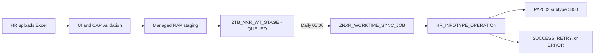

# HR Upload - Deferred SAP HR Synchronization

## Luong xu ly

Upload khong ghi truc tiep vao PA2002. CAP chi dua du lieu hop le vao staging. Job SAP xu ly cac ban ghi co `WorkDate` nho hon ngay hien tai, vi vay job bi lo mot ngay van co the xu ly backlog o lan chay sau.

## SAP objects

| Object | Vai tro |
| --- | --- |
| `ZTB_NXR_WT_STAGE` | Bang staging, audit va trang thai dong bo |
| `ZCE_NXR_WORKTIME` | Root view entity tren staging |
| `ZCL_NXR_WORKTIME_SAVE` | Managed RAP behavior pool |
| `ZSD_NXR_WORKTIME_UPLOAD` | Service definition hien huu |
| `ZUI_NXR_WORKTIME_UPLOAD` | OData V4 service binding hien huu |
| `ZNXR_WORKTIME_SYNC_JOB` | Report post PA2002 va retry |

`ZTB_NXR_WT_STAGE` nam trong package `ZPK_ZNXR09C100`, transport `S40K918680`. Report dang nam trong local package `$ZNXR09F500`; can gan report vao package/transport chinh thuc truoc khi chuyen sang he thong tiep theo.

## Trang thai

- `QUEUED`: da ghi staging, cho job.
- `RETRY`: SAP HR posting loi tam thoi; job thu lai sau it nhat 60 phut.
- `SUCCESS`: PA2002 da ghi thanh cong va staging co `SapDocumentKey`.
- `ERROR`: da het so lan retry mac dinh (3); can HR/IT kiem tra `SyncMessage`.

## Job 05:00

- Job name: `ZNXR_HR_WORKTIME_0500`
- Program: `ZNXR_WORKTIME_SYNC_JOB`
- First run: `2026-07-17 05:00:00`
- Period: daily (`PRDDAYS = 1`)
- Monitor: transaction `SM37`
- Time basis: SAP system time

Report khoa nhan vien bang `BAPI_EMPLOYEE_ENQUEUE`, doc lai status sau khi khoa, va goi `HR_INFOTYPE_OPERATION` voi `NOCOMMIT = X`. PA2002 va status staging chi commit cung nhau. Neu staging update loi thi PA2002 duoc rollback.

Mapping hien tai:

- Infotype: `2002`
- Subtype: `0800`
- `BEGDA/ENDDA`: `WorkDate`
- `BEGUZ/ENDUZ`: `FirstEntry/LastExit`
- `STDAZ`: so gio tinh tu gio vao/ra
- Da co record cung nhan vien, ngay va subtype: `MOD`
- Chua co record: `INS`

## Kiem tra da thuc hien

- OData metadata dung `Edm.Date` va `Edm.TimeOfDay`.
- Managed RAP smoke test tra `201 Created`, audit fields duoc tu dong dien.
- Ban ghi smoke test da duoc xoa; staging khong con du lieu test.
- Report da activate va chay thanh cong khi queue rong.
- ATC report: `0 errors`, `0 warnings`; con cac info ve text element, timezone system va rollback co chu dich.
- Local checks: `node --check`, `cds compile`, XML parse va `git diff --check` deu pass.

## Truoc production

1. Gan `ZNXR_WORKTIME_SYNC_JOB` vao package va transport chinh thuc.
2. Tao lai job tai he thong dich sau import; schedule khong di theo transport.
3. Cau hinh `SAP_WORKTIME_URL`, `SAP_WORKTIME_USERNAME`, `SAP_WORKTIME_PASSWORD` bang secret/destination, khong dung fallback credential.
4. Test mot nhan vien/ngay da duoc phep thay doi, doi chieu `PA30`, `PA2002`, staging va WorkSchedule.
5. Xac nhan timezone cua application server de `05:00` dung gio nghiep vu mong muon.
